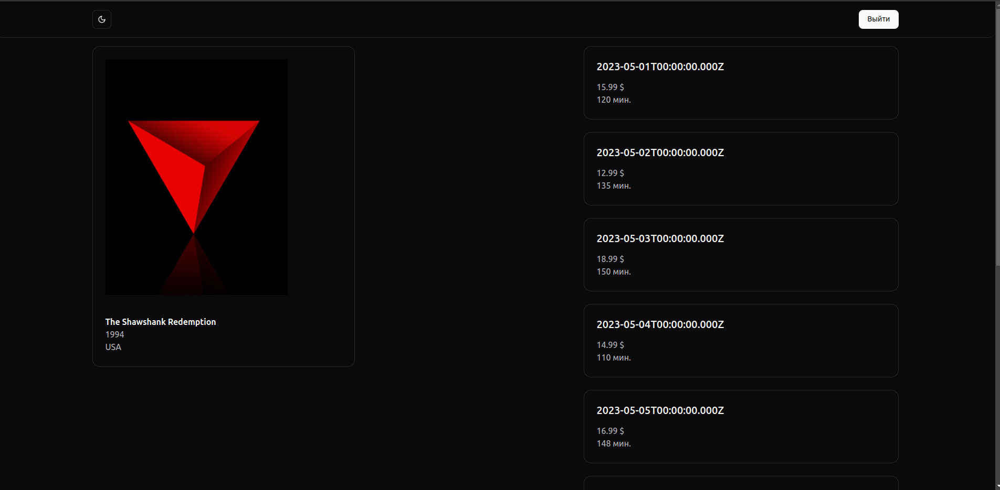
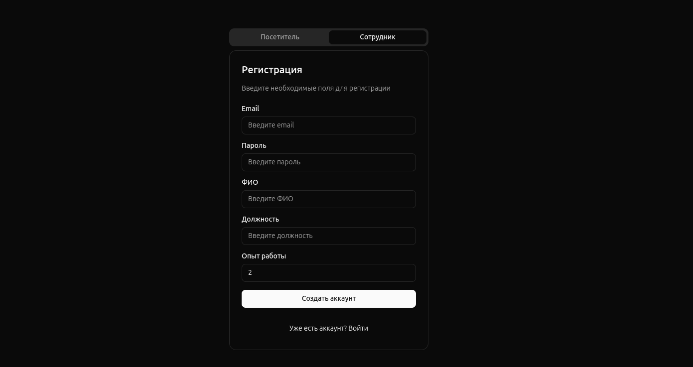
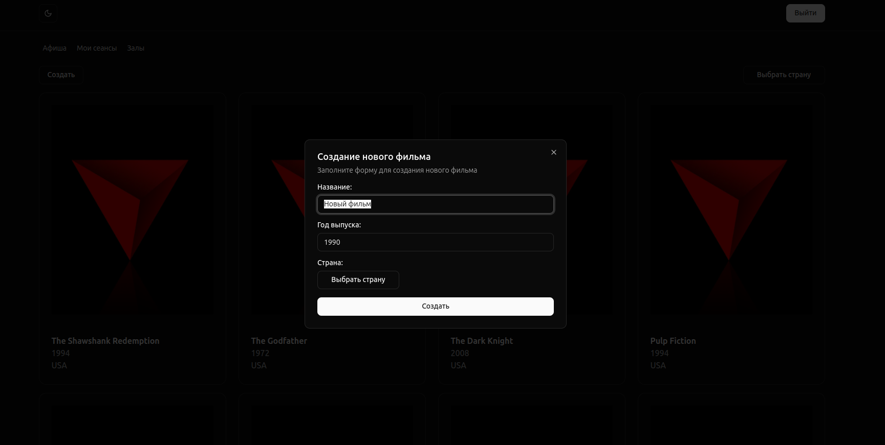

## Время выполнения (в часах)

| Задача                                                 | Оптимистичная | Пессимистичная | Наиболее вероятная | План  | Факт |
| ------------------------------------------------------ | ------------- | -------------- | ------------------ | ----- | ---- |
| Установка и настройка зависимостей                     | 0.5           | 1              | 0.5                | 0.58  | 0.5  |
| Регистрация                                            | 1.5           | 3              | 2                  | 1.41  | 1.5  |
| Вход в аккаунт                                         | 1             | 2.5            | 1                  | 1.25  | 1.2  |
| Темная тема                                            | 0.5           | 1              | 0.5                | 0.58  | 0.5  |
| Защищенные роуты и защищенные элементы                 | 0.5           | 1.5            | 0.7                | 0.8   | 0.6  |
| Создание сущностей                                     | 0.5           | 1              | 0.6                | 0.65  | 0.5  |
| Компонент хедера                                       | 0.7           | 1.3            | 1.1                | 1.06  | 1    |
| Запросы для сущностей                                  | 1.2           | 2              | 1.5                | 1.53  | 1.5  |
| Компоненты форм для Film и Hall                        | 1.5           | 3              | 2.1                | 2.15  | 2.3  |
| Компонент списка сеансов                               | 1             | 2              | 1.2                | 1.3   | 1.3  |
| Модальные окна для создания/редактирования Film и Hall | 1.2           | 3              | 1.7                | 1.83  | 1.5  |
| Создание страниц                                       | 1.5           | 2              | 1.5                | 1.58  | 1.7  |
| Настройка роутинга                                     | 0.5           | 0.8            | 0.5                | 0.55  | 0.5  |
| Итого                                                  |               |                |                    | 15.27 | 14.6 |

## UI

### Афиша

### Один фильм

### Авторизация

#### Вход

#### Регистрация

### Пользователь

#### Все фильмы отображаются

#### Только его сеансы

### Сотрудник

Отличается от посетителя наличейм вкладки с залами и кнопками создания фильма/сеанса/зала.

#### Все фильмы

#### Создание фильма

#### Сеансы аналогично фильмам

#### Залы

#### Создание зала

